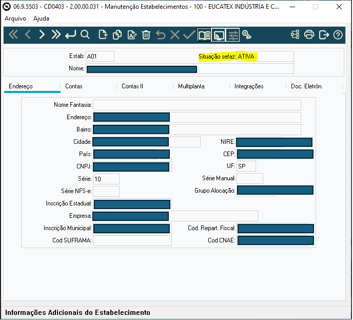

# Projeto de Controle de Estabelecimentos no Datasul

Este projeto permite controlar e monitorar a situação dos estabelecimentos junto ao SEFAZ utilizando o sistema TOTVS Datasul.

Com esse código, é possível monitorar os estabelecimentos da empresa cadastrados no CD0403 no sefaz, hoje existe uma opção para pagar por essa utilização da API, com esse programa é utilizada as 3 verificações gratúitas por hora, com isso, rodando em 1 dia é possível valiadar 72 estabelecimentos por dia e cerca de 2.160 por mês.

Ao realizar a verificação, ele grava na tabela estabelec-fiscal  (arquivo .df com a tabela zipada) como "ativa" ou "baixada", uma vez que o estabelecimento está com a situação baixada no SEFAZ não será possível realizar o faturamento, uma vez que o será bloqueado no FT0114, reduzindo assim possíveis faturamentos indesejados.

## Estrutura do Projeto

- **ucd0403.p**: Programa responsável por verificar e exibir a situação SEFAZ dos estabelecimentos, definindo status como "Ativa" ou "Baixada".
- **upft0114.p**: Realiza consultas de séries e estabelecimentos. Impede a modificação de estabelecimentos com status "Baixada", exibindo uma mensagem de erro.
- **escd0403.w**: Interface gráfica para auditoria dos dados de estabelecimentos.
- **escd0403rp.p**: Realiza a exportação dos registros de monitoramento dos estabelecimentos para um arquivo de texto e gera relatórios.

## Imagens

Imagens de demonstração estão na pasta `imagens`, que mostram as configurações dos programas e a interface de auditoria.

## Imagens de Demonstração

### Configuração do Programa FT0114

### Configuração do Programa CD0403

### Tela de Situação SEFAZ

### Tela de Auditoria de Estabelecimento

### Mensagem de Erro para Estabelecimentos Baixados

## Como Usar

1. **Instalar no Datasul**: Coloque os arquivos `.p` e `.w` no ambiente do Datasul, na pasta de programas correspondente.
2. **Configuração de Programas**:
   - FT0114: Configuração para consulta de Série e Estabelecimento.
   - CD0403: Configuração para manutenção e verificação de status no SEFAZ.
3. **Execução**:
   - Acesse o programa CD0403 para visualizar e alterar (se permitido) o status dos estabelecimentos.
   - Use o programa FT0114 para consultas de série e estabelecimento, respeitando restrições para estabelecimentos baixados.

## Mensagens de Erro

- "Estabelecimento baixado, não pode ser alterado, procurar área fiscal!": Essa mensagem será exibida quando se tentar alterar um estabelecimento que está com status "Baixada".

## Licença
Inclua uma licença adequada para o projeto.
